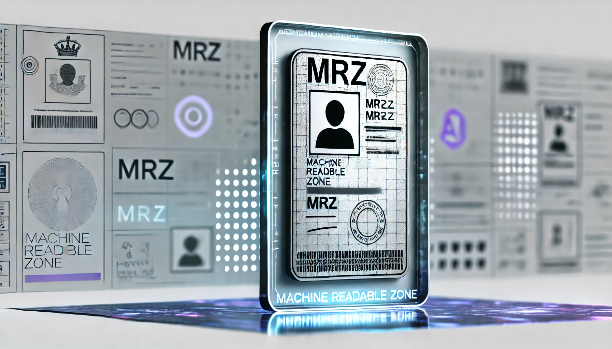
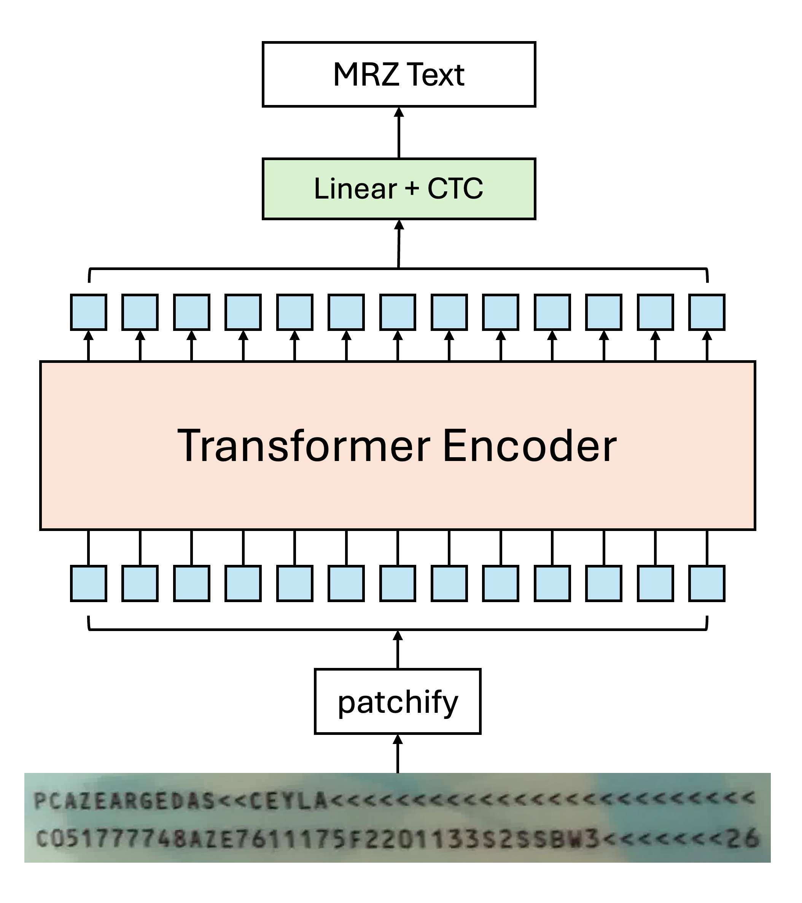
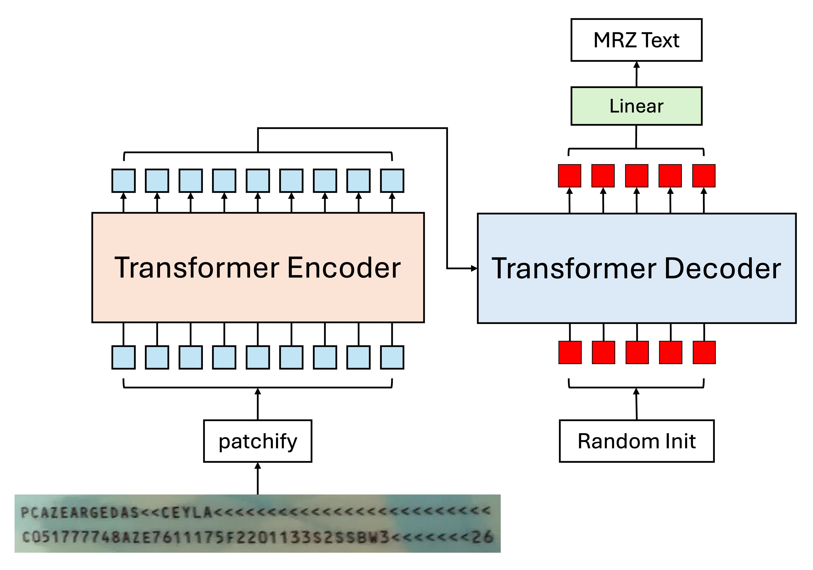
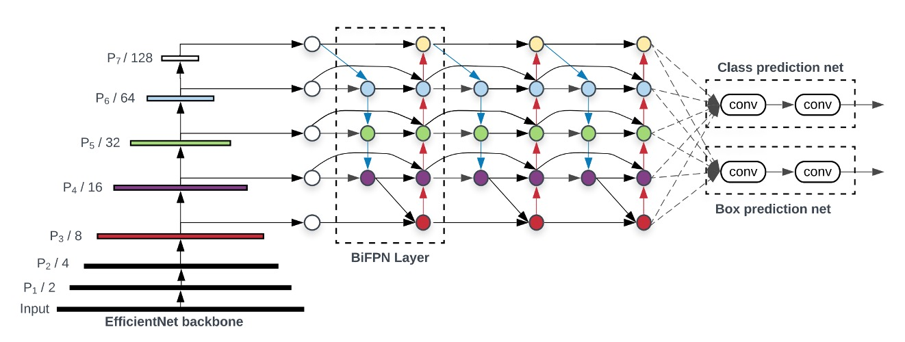

**[English](./README.md)** | [中文](./README_tw.md)

# MRZScanner

<p align="left">
    <a href="./LICENSE"></a>
    <a href="https://github.com/DocsaidLab/MRZScanner/releases"></a>
    <a href=""></a>
</p>

## Introduction

<div align="center">
    
</div>

MRZ (Machine Readable Zone) refers to a specific area on travel documents such as passports, visas, and ID cards. The information in this area can be quickly read by machines. MRZ is designed and generated according to the International Civil Aviation Organization’s (ICAO) Document 9303, intended to speed up border checks and improve the accuracy of data processing.

While many may not be familiar with MRZ, most people have a passport, which contains an MRZ block. It typically looks like the section outlined in red:

<div align="center">
    
</div>

## Technical Documentation

Due to the extensive usage instructions and setup explanations for this project, we have only summarized the "Model Design" section here.

For installation and usage instructions, please refer to the [**MRZScanner Documents**](https://docsaid.org/en/docs/mrzscanner/).

## Model Design

During the testing phase, we are initially releasing an end-to-end single-stage model.

The two-stage model that separates localization and recognition is not yet available, but we plan to release it in the V1.0 stable version.

However, that won't stop us from discussing the detailed approach here.

## Two-Stage Recognition Model

The two-stage model splits MRZ recognition into two phases: localization and recognition.

Based on this idea, we can start designing the model. Let’s first take a look at the localization model.

### Localization Model

MRZ localization can be approached in two ways:

1. **Locating MRZ corner points:**

   <div align="center">
        
    </div>

   This is similar to previous document localization projects we've worked on, except here we’re localizing the MRZ area instead of the whole document.

   The difference is that document corners "physically" exist on the image, and the model doesn’t need to “imagine” a corner. For the MRZ area, however, the model needs to "guess" where these corners are.

   It turns out that using this method leads to an unstable model. If the passport is slightly moved, the predicted corners of the MRZ area tend to jump around.

   ***

2. **Segmenting the MRZ area:**

    <div align="center">
        
    </div>

   This approach is much more stable, as we can directly predict the MRZ region using a segmentation model. The text within the MRZ area physically exists in the image, so the model doesn’t have to "imagine" anything extra. This allows us to segment the MRZ region directly without worrying about corner points.

---

We’ve chosen the segmentation method.

In real-world scenarios, passports are often held at slight angles. Therefore, we need to correct the MRZ region to transform it into a proper rectangle.

Regarding the loss function, we referred to a survey paper:

- [**[20.06] A Survey of Loss Functions for Semantic Segmentation**](https://arxiv.org/abs/2006.14822)

This paper offers a unified comparison and introduction to various loss functions for segmentation proposed over recent years. It proposes a solution to existing issues: **Log-Cosh Dice Loss**.

For those interested, you can refer to the paper; we won’t go into detail here.


### Recognition Model

The recognition model is much simpler. Since we’ve already segmented the MRZ region, we just need to pass that region to a text recognition model to get the final result.

At this stage, there are a couple of design options:

1. **Segment the text and recognize it piece by piece:**

   Some MRZs have two lines of text, such as in the TD2 and TD3 formats; others have three lines, like the TD1 format. We can segment these lines of text and recognize them one by one.

   The recognition model’s job is to convert a string of text from an image into output. There are many methods available, such as the classic CRNN+CTC or more modern approaches like CLIP4STR.

2. **Recognize the entire cropped MRZ region at once:**

   Since the aspect ratio of the MRZ region doesn’t vary much, we can crop the whole MRZ area and recognize it in one go. In this case, transformer-based models are especially suitable for solving this problem.

   For example, if you use a Transformer Encoder structure, the model design could look like this:

    <div align="center">
        
    </div>

   Due to the self-attention mechanism, there could be multiple tokens pointing to the same character. Using a typical decoding method could confuse the model—why should it decode one character's image into another character?

   Using CTC for text decoding works better here because each token corresponds to a part of the image related to a specific character. In the final stage, we just need to merge the outputs to get the final text result.

   ***

   If you don’t like CTC and find it cumbersome, you can use an Encoder-Decoder architecture instead, where the model design would look like this:

    <div align="center">
        
    </div>

   This approach allows direct string decoding without needing CTC since the tokens fed into the Decoder are text queries, and each token is responsible for finding the corresponding character in sequence.

   The Decoder here can output in parallel; autoregressive decoding is unnecessary. Autoregressive decoding is typically used when each prediction depends on the previous one.

   In this case, the character predicted at the first position doesn’t affect the second position. They’re independent, as all relevant information is already present in the Encoder output. The Decoder’s job is simply to query and retrieve it.

### Error Propagation

This brings us back to the issue of corner points.

All two-stage models face a common challenge: **error propagation**.

No model is 100% accurate. Since we can never fully model the statistical population, every rule has exceptions, and every model has errors. Regardless of the method chosen, the final challenge is the same:

- **Inaccurate corner estimation**

Inaccurate corner estimation leads to an inaccurate MRZ region after correction. An inaccurate MRZ region then leads to inaccurate text recognition. This becomes a classic example of error propagation.

## Single-Stage Recognition Model

The primary challenge of a single-stage model is dealing with multi-scale features.

The MRZ region can vary with the user’s capture angle, meaning that before detecting text, we must handle the image at different scales.

### Model Architecture


### Backbone


Recently, Google released a new paper: **MobileNet-V4**, which is optimized for mobile devices. This is great news for us, and we’ll use it as our Backbone, using the pretrained weights from `timm`, with an input image size of 512 x 512 in RGB.

- [**[24.04] MobileNet-V4: The Legacy After Five Years**](https://docsaid.org/papers/cnns/lightweight/mobilenet-v4/)
- [**huggingface/pytorch-image-models**](https://github.com/huggingface/pytorch-image-models)

After testing, we found that at an input resolution of 512 x 512, the text size in the MRZ area is around 4 to 8 pixels. Reducing the resolution further leads to blurry text in the MRZ area, degrading recognition performance.

### Neck



To better fuse multi-scale features, we introduced BiFPN. By allowing bidirectional flow of contextual information, BiFPN enhances feature representation. It produces a set of rich, scale-aware feature maps that effectively capture objects at different scales, positively impacting prediction accuracy.

In our ablation study, we tried removing this component and directly using the Backbone output feature maps, but training failed.

- [**[19.11] EfficientDet: BiFPN Is the Key**](https://docsaid.org/papers/feature-fusion/bifpn/)

### Patchify

Now for some unconventional experimentation.

---

We need to convert feature maps from each stage into a format that Transformers can process. Here, we use standard convolution operations to turn feature maps into patches.

Here are some of our settings:

1.  **Patch Size: 4 x 4.**

    We measured the text size in the MRZ area and found that small characters are around 4 to 8 pixels. Given this, we set the patch size to 4 x 4.

2.  **Each feature map has a corresponding Patch Embedding and Position Embedding.**

    Since each feature map has a different scale, they can’t share the same embedding, or information exchange across scales won’t work properly. We considered designing a shared embedding, but it was too complex, so we abandoned that idea.

    We also tested shared weights for Patch Embedding, where all feature maps share the same Conv2d for embedding, but the results were poor.

### Cross-Attention

Finally, we used Cross-Attention for text recognition.

We randomly initialized 93 tokens.

- **Why 93 tokens?**

We based this on the longest MRZ format, TD1, which has 90 characters. TD1 has three lines, so we need 2 "separator" characters. Additionally, we need one "end" character, making a total of 93 tokens.

The separator character is `&`, and the end character is `[EOS]`. If there are extra positions, we mark them with `[EOS]`, and the model can predict whatever it wants beyond that point, but we won’t supervise it.

---

For the Transformer decoder, here are the basic settings:

- Dimension: 256
- Layers: 6
- Attention heads: 4
- Dropout: 0
- Normalization: Post-LN

The main design philosophy of this architecture is to provide the Decoder with a "multi-scale" feature space so it can freely choose the appropriate scale for text recognition. We don't need to worry about the position of the text in the image—this is up to the model to handle.

### Additional Notes

During the experiment, we kept some records, which may be helpful:

1. **Models with dimensions 64 and 128 can converge, but reducing the dimension doubles the convergence time.**

   On an RTX4090, training a model with 256 dimensions takes around 50 hours. For 128 dimensions, it takes around 100 hours; for 64 dimensions, about 200 hours.

   Why not try 512 dimensions? Because it makes the model too large, exceeding 100 MB, which isn't what we want.

---

2. **Adding extra branches, like Polygon or text center points, can speed up convergence.**

   But it’s impractical! Collecting data is hard enough; adding MRZ area annotation makes it even more challenging. In the end, the benefits don’t justify the effort.

---

3. **Removing the Neck.**

   It can still converge, but the time triples, so think carefully.

---

4. **Removing position encoding.**

   No convergence.

---

5. **Adjusting weight decay from $10^{-5}$ to $10^{-2}$.**

   Faster convergence but reduced generalization.

   Small models inherently have some regularization, so they don’t need strong weight decay.

---

6. **Using Pre-LN.**

   Faster convergence but reduced generalization.

   Pre-LN reduces model depth to some extent, which isn’t ideal for small models.

---

7. **Increasing data augmentation.**

   To speed up experiments, we limited the rotation of MRZ images to within ±45 degrees.

   We tried using full rotation and more augmentations, but the model couldn’t handle such a heavy load and failed to converge.

## Conclusion

We believe the current single-stage model design is still missing some key components. We plan to continue reading more literature and conducting further experiments.

Scaling up the model size is probably the most effective solution. The challenge lies in how to meet all these requirements while maintaining a "lightweight" parameter size, which is our next focus.

As mentioned earlier, this problem can already be solved reliably in almost all cases with a **two-stage** solution. If you're serious about this, we still recommend going back to developing a two-stage model, which will save you from many unnecessary headaches.

## Citations

We thank all the predecessors whose work significantly helped our research.

If you find our work helpful, please cite our repository:

```bibtex
@misc{yuan2024mrzscanner,
  author = {Ze Yuan},
  title = {MRZScanner},
  year = {2024},
  publisher = {GitHub},
  journal = {GitHub repository},
  howpublished = {\url{https://github.com/DocsaidLab/MRZScanner}}
}
```
