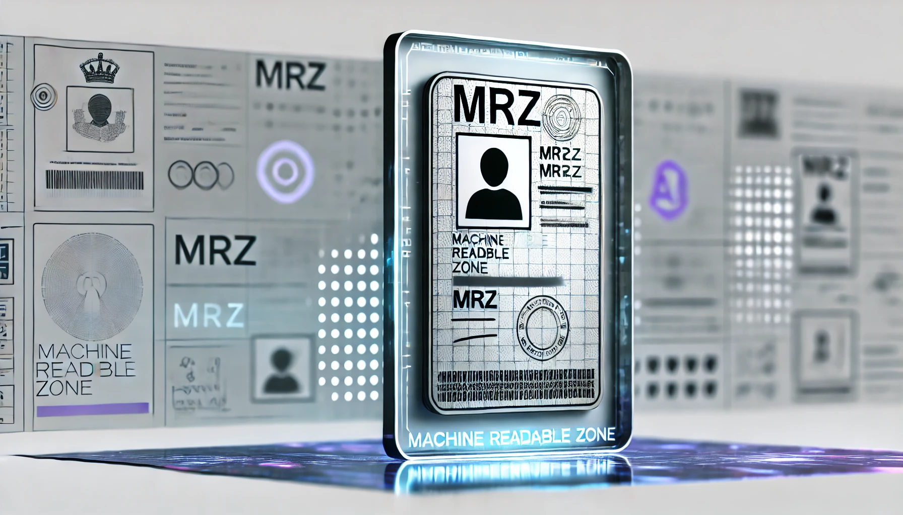
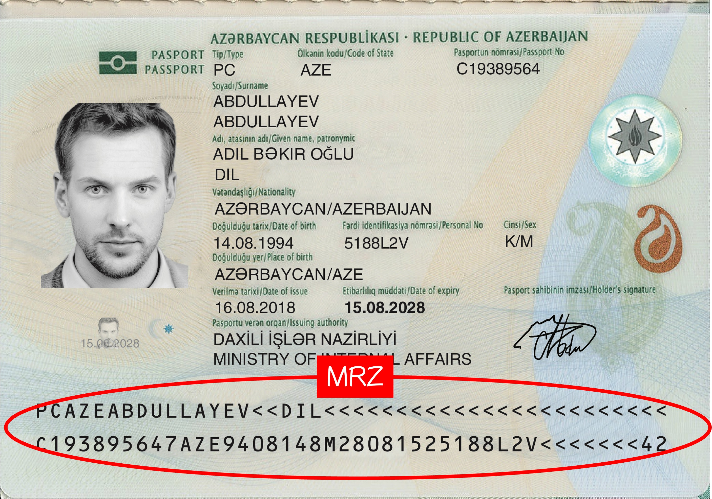
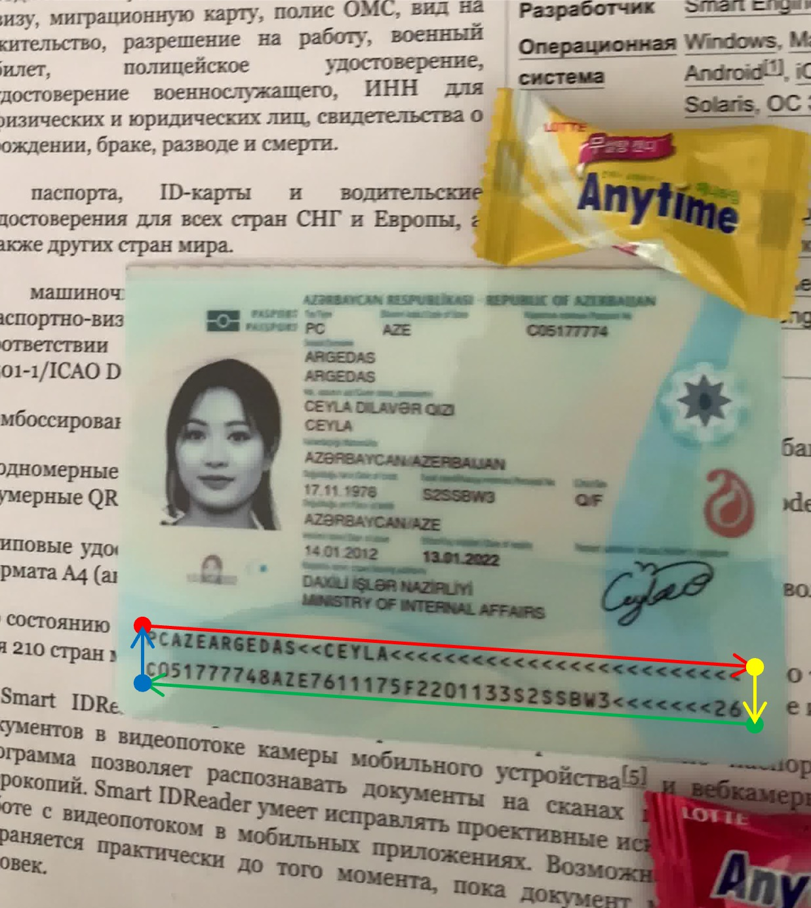
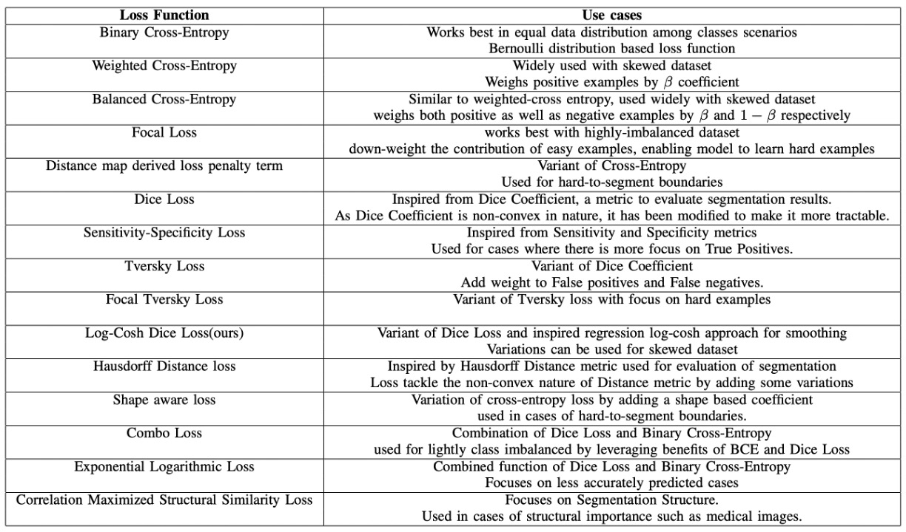
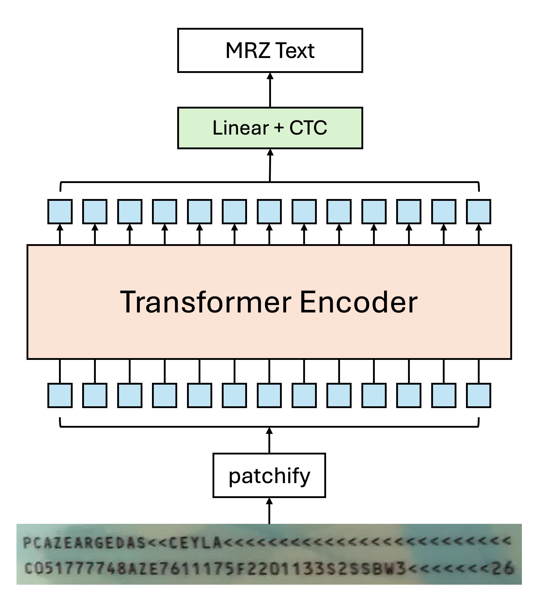
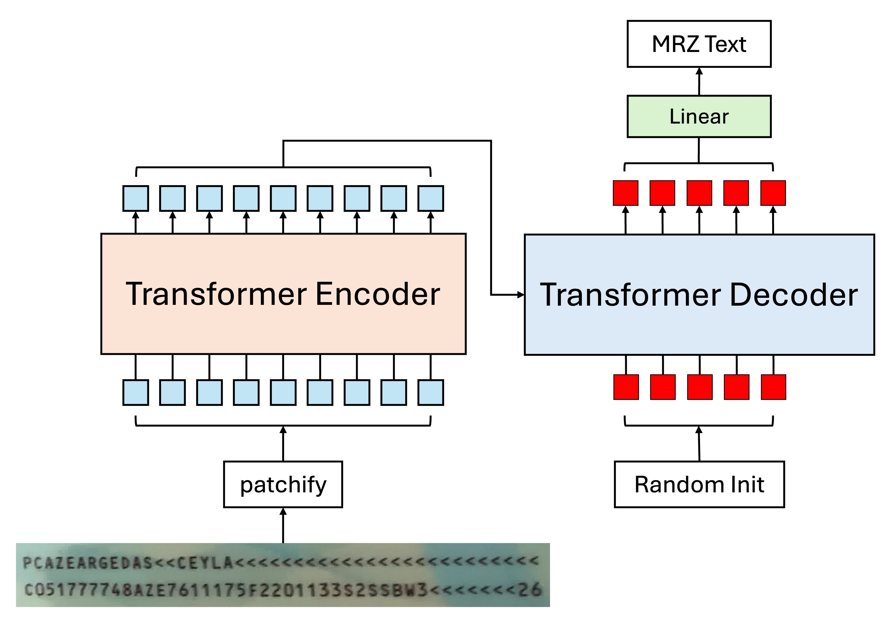
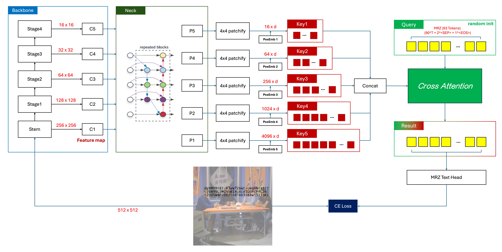
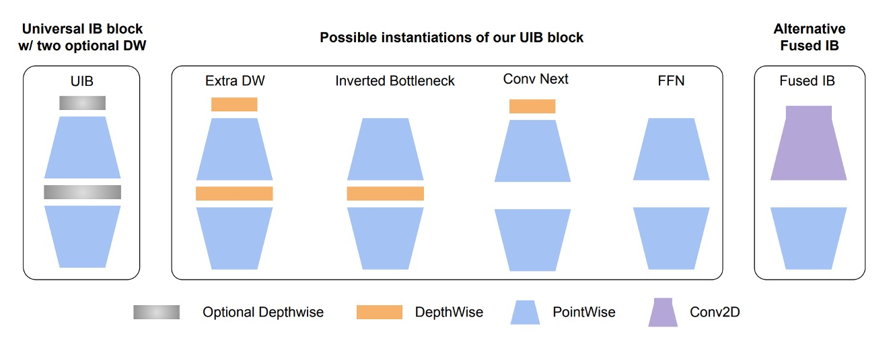
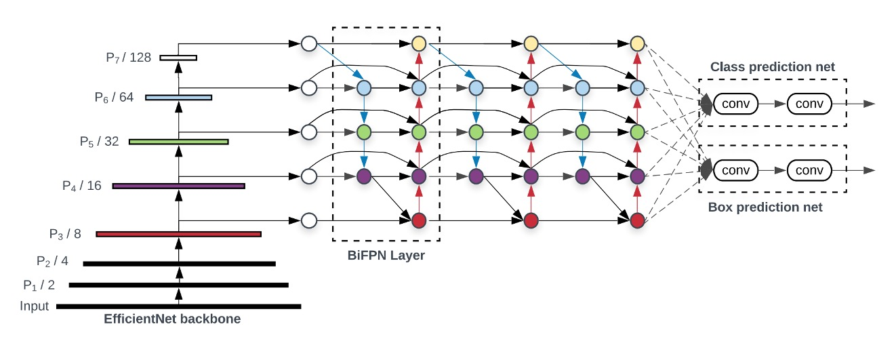

**[English](./README.md)** | [中文](./README_tw.md)

# MRZScanner

<p align="left">
    <a href="./LICENSE"></a>
    <a href="https://github.com/DocsaidLab/MRZScanner/releases"></a>
    <a href=""></a>
</p>

## 介紹

<div align="center">
    
</div>

MRZ（Machine Readable Zone，機器可讀區）指護照、簽證、身分證等旅行證件上的一段特定區域，該區域內的資訊可以被機器快速讀取。 MRZ 依照國際民航組織（ICAO）第 9303 號文件的規定進行設計和生成，用於加快邊境檢查和提高資訊處理的準確性。

人們可能不知道 MRZ 是什麼，但通常手上都有一本護照，上面就有 MRZ 區塊，長得類似這樣，紅色框的部分：

<div align="center">
    
</div>

## 技術文件

由於本專案的相關使用方式和設定的說明佔據非常多的篇幅，因此我們謹摘要「模型設計」的部分放在這裡。

套件安裝和使用的方式，請參閱 [**MRZScanner Documents**](https://docsaid.org/docs/mrzscanner/)。

## 模型設計

測試階段，我們先開放端到端的一階段模型。

拆分定位和辨識的二階段模型現在沒有開放，預計之後發佈在 V1.0 穩定版。

但不妨礙我們來討論一下具體做法。

## 二階段辨識模型

二階段模型指的是將 MRZ 辨識分為兩個階段：定位與辨識。

根據這個思路，我們可以開始著手設計相關模型，首先來看看定位模型。

### 定位模型

MRZ 區域的定位大概可以分成兩個方向:

1. **定位 MRZ 區域角點：**

    <div align="center">
    
    </div>

   這和之前我們做過的文件定位的專案類似，只是這裡把文件換成 MRZ 區域。

   不同的地方在於文件定位的角點是「真實」存在於圖面上，不需要模型去「憑空想像」出一個角點。反觀 MRZ 區域，我們需要模型去「猜測」出這個角點。

   事實證明，用這種方式做出來的模型很不穩定，只要你稍微晃動一下護照，模型預測的角點就會在 MRZ 區域周邊到處亂跑。

   ***

2. **分割 MRZ 區域：**

    <div align="center">
    
    </div>

   這個方法就比較穩定了，因為我們可以直接用分割模型去預測 MRZ 區域的範圍。MRZ 區域上的文字也是真實存在於圖面上，不需要模型做「多餘」的臆測。這樣一來，我們就可以直接將 MRZ 區域分割出來，不需要再去擔心角點的問題。

---

我們採用的是分割的方法。

在真實使用的場景中，使用者所拿的護照必然帶有一些傾斜，因此我們需要對 MRZ 區域進行校正，使其變成一個正確的矩形。

損失函數的部分我們參考了一份綜述性的論文：

- [**[20.06] A survey of loss functions for semantic segmentation**](https://arxiv.org/abs/2006.14822)

在上面這篇論文中，針對過去幾年間所提出的各種用於分割的損失函數進行統一的比較和介紹，並且針對現有的問題提出一個解決方案，也就是：**Log-Cosh Dice Loss**。

有興趣的讀者可以參考這篇論文，這裡就不再贅述了。



### 辨識模型

辨識模型就比較簡單了，因為我們已經將 MRZ 區域分割出來，只需要將這個區域丟進文字辨識模型，就可以得到最終的結果。

在這個階段，我們可以有幾個設計方向：

1. **切分字串，逐一辨識：**

   有些 MRZ 是兩行文字，例如 TD2 和 TD3 格式；有些 MRZ 是三行文字，例如 TD1 格式。我們可以將這些文字逐一切分，然後進行辨識。

   辨識模型需要處理的就是將一串文字影像轉成文字輸出，可以用的方法有很多，例如早期流行的 CRNN+CTC，或是現在比較流行的 CLIP4STR 之類的。

2. **整張 MRZ 裁切影像一起辨識：**

   由於 MRZ 區域的長寬比例差距不大，所以我們完全可以將整張 MRZ 區域裁切下來，然後一次辨識整張影像。這種情況下，特別適合使用 Transformer 的模型來解決這個問題。

   舉例來說，如果你只要使用 Transformer Encoder 的架構，那模型設計可以是這樣：

    <div align="center">
    
    </div>

   由於自注意力機制的關係，因此可能會有多個 Token 同時指向同一個文字的情況，這時候如果使用一般的解碼方式，可能會讓模型感到困惑：明明就是這個文字的影像，為什麼要解碼成另外一個文字？

   這裡使用 CTC 的方式進行文字解碼的效果會比較好，因為每個 Token 都來自於「某個」文字區域的影像，我們只需要在最後階段對輸出結果合併，就可以得到最終的文字結果。

   ***

   或是你不喜歡 CTC，覺得那是個麻煩的東西，那你可以採用 Encoder-Decoder 的架構，模型設計可以是這樣：

    <div align="center">
    
    </div>

   這種方式可以直接解碼字串，不需要再經過一層 CTC，因為輸入 Decoder 的 token 就是對文字的查詢，每個 token 都負責找出對應順序的文字。

   這裡的 Decoder 可以直接平行輸出，不需要用自回歸的方式。使用自回歸是因為我們需要基於前一次的預測結果，來進行下一個預測。

   這裡顯然並不需要這種操作。

   試想：不論第一個位置預測的文字是什麼，都不會影響第二個位置的預測結果，他們彼此之間是獨立的。所有客觀結果都已經在 Encoder 的輸出結果內，Decoder 的工作就是負責把他們查詢出來而已。

### 誤差傳播

這時候其實可以回過頭去討論角點的問題。

所有二階段的模型都會面臨到一個共同的問題：**誤差傳播**。

我們都相信這世界上不存在 100% 準確的模型，因為我們永遠都無法對統計母體進行建模，所以凡規則必有例外，凡模型必有誤差。不管上面選擇哪種方式，最後都會面臨到同樣的困難：

- **角點估計不準確**

正因為角點估計不準確，導致校正後的 MRZ 區域不準確；又因為 MRZ 區域不準確，導致文字辨識的不準確，如此這般，成為一個誤差傳播的標準教材。

## 單階段辨識模型

單階段的首要困難就是多尺度特徵。

MRZ 的區域會隨著使用者拍攝角度的不同而有所變化，這就意味著我們在開始偵測文字之前，必須先對圖片進行多尺度的處理。

### 模型架構



### Backbone



剛好最近 Google 發布了新論文：**MobileNet-V4**，這個模型有針對移動裝置上的效能進行優化，這對我們來說是一個很好的消息，直接拿來用。

這次我們就用它來做為我們的 Backbone，使用 timm 的預訓練權重，輸入影像尺寸設定為 512 x 512 的 RGB 影像。

- [**[24.04] MobileNet-V4: 時隔五年的傳承**](https://docsaid.org/papers/cnns/lightweight/mobilenet-v4/)
- [**huggingface/pytorch-image-models**](https://github.com/huggingface/pytorch-image-models)

經過測試，輸入影像解析度為 512 x 512 時，每個 MRZ 的文字大小大約是 4~8 個像素，若持續降低解析度，MRZ 區域的文字會有模糊的情況，導致辨識效果不佳。

### Neck



為了更好地融合多尺度的特徵，我們引入了 BiFPN。通過上下文信息的雙向流動，增強了特徵的表達能力。BiFPN 會產生一系列尺度豐富且語義強的特徵圖，這些特徵圖對於捕捉不同尺度的對象非常有效，並對最終的預測精度有正面影響。

我們在消融實驗的時候，有試著移除這個部分，改成直接使用 Backbone 輸出的特徵圖，但 Train 不起來。

- [**[19.11] EfficientDet: BiFPN 才是本體**](https://docsaid.org/papers/feature-fusion/bifpn/)

### Patchify

前面都是中規中矩的常規操作。

接著都是我們自己的天馬行空的嘗試了。

---

首先我們得把每個階段的特徵圖轉換成 Transformer 的輸入格式，這裡我們使用一般的卷積操作，將特徵圖轉換成一個個的 Patch。

以下是我們的一些設定：

1.  **Patch Size: 4 x 4。**

    我們手動測量一下 MRZ 區域內的文字大小，發現小字大概是 4~8 個像素，再小就看不清楚文字內容。大字的部分尺寸不固定，根據拍攝距離來決定。因此我們考量到這個因素，將 Patch Size 設定為 4 x 4。

2.  **每個特徵圖有一組對應的 Patch Embedding 和 Position Embedding。**

    由於每個特徵圖的尺度不一樣，所以不能共用同一組 Embedding，這樣會導致不同尺度的特徵圖無法正確地進行信息交換。我們有考慮過設計一組共享的 Embedding，但實作起來較複雜，我們暫時放棄這個想法。

    Patch Embedding 的部分，我們有測試過 Shared Weighted 的方式，就是所有特徵圖都共用同一個 Conv2d 來進行 Embedding，但效果很差。

### Cross-Attention

最後我們使用了 Cross-Attention 的方式來進行文字辨識。

我們隨機初始化了 93 個 Token。

- **為什麼是 93 個？**

這是考慮到 MRZ 最長的格式為 TD1，共有 90 個字元。又 TD1 有三行，因此需要 2 個「分隔」字元。接著還需要一個「結束」字元，共 93 個。

連接字元的部分我們使用 `&`，結束字元的部分我們使用 `[EOS]`。如果有多餘的位置，我們會以 `[EOS]` 作為邊界，後續字元不進行監督，模型想怎麼預測就怎麼預測，我們不會再去理會。

---

Transformer decoder 的部分，我們給的基本設定是這樣：

- 維度： 256
- 層數： 6
- 注意力頭： 4
- Dropout： 0
- Normalization： Post-LN

這個架構的主要設計理念：我們幫 Decoder 準備好一個「多尺度」的特徵空間，讓 Decoder 可以自由地選擇不同尺度的特徵來進行文字辨識。其中我們不需要關心文字在影像中的位置，這個問題全權交給模型自己想辦法解決。

### 還有更多

在整個實驗過程中，我們有留下一點實驗紀錄，我們一併寫在這裡，或許能對你有所幫助。

1. **維度 64 和 128 的模型都可以收斂，但每減半一次維度，模型的收斂速時間加倍。**

   我們的訓練設備是 RTX4090，訓練一個 256 維度的模型需要 50 小時左右；訓練一個 128 維度的模型需要 100 小時左右；訓練一個 64 維度的模型需要 200 小時左右。

   為什麼沒有試 512 維度？因為這樣會讓模型變得太大，就超過 100 MB 了，這個大的模型不是我們想要的。

---

2. **新增額外的分支，例如 Polygon 或是文字的中心點位置等，可以提升模型的收斂速度。**

   但是不好用啊！收集資料已經很困難，還要找到資料的 MRZ 區域，還要標記這些資料，顯然不適合推廣。

   最後收斂效果類似，對整體的貢獻不大。

---

3. **移除 Neck。**

   還是可以收斂，但是時間多三倍，得仔細想想。

---

4. **移除位置編碼。**

   不收斂。

---

5. **調整 Weight Decay 從 $10^{-5}$ 到 $10^{-2}$。**

   提早收斂，但是泛化能力降低。

   小模型天生帶有一定的正規化效果，因此不需要太強的 Weight Decay。

---

6. **使用 Pre-LN。**

   提早收斂，但是泛化能力降低。

   Pre-LN 會一定程度地降低模型深度，因此對於小模型來說，不能再降了。

---

7. **增加更多影像增強。**

   為了加快實驗的腳步，我們控制 MRZ 圖像的旋轉角度在正負 45 度之間。

   我們嘗試使用全方位的旋轉和更多其他影像增強，但這個規模的模型承受不起這麼多的影像增強，直接導致不收斂。

## 結論

我們認為目前單階段的模型設計，還少了一些關鍵性的元件，這個部分我們之後會持續閱讀更多的文獻，並且進行更多的實驗。

或許加大模型規模肯定是最有效的方式。難就難在該如何用「輕量」的參數規模，來滿足上面所有的需求，這也是我們接下來需要思考的問題。

但之前我們也說了，這個題目實際上用「二階段」的解決方案就可以穩定的解決幾乎所有場景。如果你真的想做的話，我們還是會建議你回過頭去開發一個二階段的模型，這樣會省去很多不必要的麻煩。

## 引用

我們感謝所有走在前面的人，他們的工作對我們的研究有莫大的幫助。

如果您認為我們的工作對您有幫助，請引用我們的工作：

```bibtex
@misc{yuan2024mrzscanner,
  author = {Ze Yuan},
  title = {MRZScanner},
  year = {2024},
  publisher = {GitHub},
  journal = {GitHub repository},
  howpublished = {\url{https://github.com/DocsaidLab/MRZScanner}}
}
```
