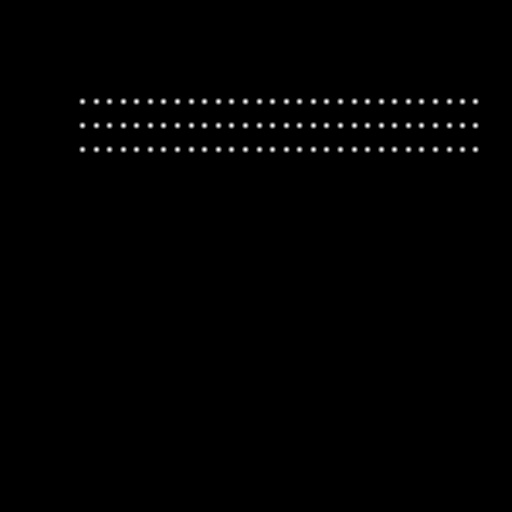

**[English](./README.md)** | [中文](./README_tw.md)

# Dataset

Since MRZ images are mostly found in personal documents, we couldn’t find enough real training data.

From the start, we decided not to use real data but rather to rely entirely on **synthetic datasets**. We developed our own synthetic dataset generator, which can create various MRZ formats, and allows control over text content, fonts, sizes, colors, and more.

## Training Dataset

Although we do not release our training module, we have made our custom synthetic dataset available on GitHub:

- [**MRZScanner/dataset/train_dataset.py**](https://github.com/DocsaidLab/MRZScanner/blob/main/dataset/train_dataset.py)

Before you can start using it, there are a few things you’ll need to handle on your own:

1. Download the dataset: [**MIT Indoor Scenes**](https://www.kaggle.com/datasets/itsahmad/indoor-scenes-cvpr-2019)

   We used this dataset for background images. After downloading, place it somewhere accessible and point the path to this folder when running the data generator.

---

2. Download the dataset: [**DocVQA**](https://www.docvqa.org/)

   Since documents with MRZ typically contain other text, simulating the presence of such unrelated text can be beneficial for model training.

   Similarly, after downloading, place it somewhere accessible and point the path to this folder when running the data generator.

   **Note**: Make sure both datasets are in the same directory, as we only provide a single path parameter for specifying the location.

---

3. Install the module: [**WordCanvas**](https://github.com/DocsaidLab/WordCanvas)

   The synthetic dataset relies on our other module, `WordCanvas`. Please install the relevant packages first.

   - [**WordCanvas Docs**](https://docsaid.org/en/docs/wordcanvas/intro)

---

Once these steps are completed, you can start generating the dataset.

Here’s how to use it:

```python
import cv2
import docsaidkit as D
from train_dataset import MRZDataset

ds = MRZDataset(
    root='/data/Dataset', # Change to your dataset path
    image_size=(512, 512),
    aug_ratio=1.0,
    return_tensor=True,  # Converts the output to a PyTorch Tensor
    length_of_dataset=1000000,  # Specify the size of the dataset
)
```

The training dataset returns multiple values, so let’s go through them:

```python
img, gt, poly, fixed_points, mrz_points_hmap, mrz_region_hmap = ds[0]
```

Although we specified `idx=0`, the `MRZDataset` generates data randomly, so the result will be different each time.

---

### 1. img

First is `img`, which we can display directly:

<div align="center">

</div>

### 2. gt

The raw `gt` is a string, which can be split using the `split` function.

By default, the MRZ is separated by `&`:

```python
print('GT original:', gt)
# >>> GT original: 9SZ563DNUUM1NEAKVHUI09MK4H9SAW&56QI04IS244AF4F0809416QQQ9MDOA&DS0CJGRAALNCT1NKPYGH5DPLAOY72L

print('GT:', gt.split('&'))
# >>> GT: ['9SZ563DNUUM1NEAKVHUI09MK4H9SAW',
#          '56QI04IS244AF4F0809416QQQ9MDOA',
#          'DS0CJGRAALNCT1NKPYGH5DPLAOY72L']
```

If you are training a text recognition model, this string will serve as your label.

### 3. poly

`poly` contains the four points of the MRZ area. We can plot it as follows:

```python
import docsaidkit as D

poly_img = D.draw_polygon(img.copy(), poly, color=(0, 255, 0))
D.imwrite(poly_img, 'poly.jpg')
```

<div align="center">

</div>

If you’re working on a region localization model, you can use these four points as your labels.

### 4. fixed_points

The dataset generator outputs three types of MRZ formats: TD1, TD2, and TD3. Since these formats have different character lengths, we need `fixed_points` to ensure the output length is consistent, otherwise PyTorch would throw an error.

These points represent the center of each character, with TD1 having a fixed output string length of 90.

We can plot the points like this:

```python
import docsaidkit as D

point_img = img.copy()
for p in fixed_points:
    if p[0] == 0 and p[1] == 0:
        break
    cv2.circle(point_img, (int(p[0]), int(p[1])), 2, (0, 0, 255), -1)

D.imwrite(point_img, 'points.jpg')
```

<div align="center">

</div>

If you're working on precise character point localization, you can use these points as your labels.

### 5. mrz_points_hmap

`mrz_points_hmap` is the heatmap of the MRZ "character center points":

<div align="center">

</div>

This image can be used for supervision if you’re using keypoint detection methods.

### 6. mrz_region_hmap

`mrz_region_hmap` is a binary image representing the MRZ text area. This is quite intuitive, so let’s display it directly:

<div align="center">

</div>

If you’re developing a segmentation model, this image can be used for supervision.

### Summary

These are all the components of this dataset. You can swap the background base dataset for something else, such as ImageNet, or replace the text noise part with another dataset like DocVQA.

---

Training with a synthetic dataset may result in poor generalization because the real-world scenarios differ significantly from synthetic ones.

From our experiments, using a synthetic dataset for training achieves about **97% ANLS** and **30% ACC** on our real-world validation set.

This means the model can detect 97% of the text in the MRZ area, but since each MRZ block contains at least 72 characters, it is considered "correct" only if all the characters are correct.

Achieving 100% accuracy is very challenging.

**Note**:

The validation data we prepared was pre-processed with the `DocAligner` module to correct angles, ensuring that each MRZ area’s tilt is within 5 degrees.

Even with such well-prepared data, the accuracy is only around 30%, which highlights the limitations of using synthetic datasets alone.

## Fine-Tuning Dataset

We used the MIDV-2020 dataset, which also contains synthetic MRZ images. Although the text content is relatively simple, the images are well-made, making it a good dataset for fine-tuning our model.

We implemented the following code to extract MRZ-containing images from the dataset:

- [**MRZScanner/dataset/finetune_dataset.py**](https://github.com/DocsaidLab/MRZScanner/blob/main/dataset/finetune_dataset.py)

Before you can start using it, you’ll need to:

1. Download the **MIDV-2020** dataset: [**MIDV-2020**](http://l3i-share.univ-lr.fr/MIDV2020/midv2020.html)

   You need to download it; otherwise, you won’t have any data to use. After downloading, place it somewhere accessible and point the path to this folder when running the data generator.

---

Once these steps are completed, you can start generating the dataset.

Here’s how to use it:

```python
import docsaidkit as D
from finetune_dataset import MRZFinetuneDataset

ds = MRZFinetuneDataset(
    root='/data/Dataset',  # Change to your dataset path
    image_size=(512, 512),
    aug_ratio=1.0,
    return_tensor=True,  # Converts the output to a PyTorch Tensor
)
```

The fine-tuning dataset returns fewer values, so let’s check them out:

```python
img, gt = ds[1]
```

That’s it! Here we only have the image and the label, no other information.

This is why our final training model only uses text supervision without auxiliary branches:

**Most fine-tuning datasets only contain text and lack additional information.**

---

### 1. img

Although there’s not much to say, here’s what the image looks like:

<div align="center">

</div>

### 2. gt

The raw `gt` is a string, which we can display directly:

```python
print('GT:', gt)
# >>> GT: PCAZEABDULLAYEV<<DIL<<<<<<<<<<<<<<<<<<<<<<<<C193895647AZE9408148M28081525188L2V<<<<<<<42

print('GT:', gt.split('&'))
# >>> GT: ['PCAZEABDULLAYEV<<DIL<<<<<<<<<<<<<<<<<<<<<<<<',
#          'C193895647AZE9408148M28081525188L2V<<<<<<<42']
```

## Training Strategy

After discussing the datasets, let’s talk about our training strategy.

We pre-trained the model using the synthetic dataset with the following parameters:

```python
ds = MRZDataset(
    root='/data/Dataset',
    image_size=(512, 512),
    aug_ratio=1.0,
    return_tensor=True,
    length_of_dataset=640000,
)
```

We trained for 100 epochs, using the AdamW optimizer with a weight decay of 1e-5 and a learning rate of 1e-4, combined with a linear decay schedule. The learning rate first ramps up over 10 epochs, then decreases linearly.

After pre-training, we fine-tuned the model using the fine-tuning dataset with the following parameters:

```python
ds = MRZFinetuneDataset(
    root='/data/Dataset',
    image_size=(512, 512),
    aug_ratio=1.0,
    return_tensor=True,
)
```

For fine-tuning, we used the AdamW optimizer with a weight decay of 1e-1 and a learning rate of 1e-6.

We stopped training when validation performance plateaued.

## Conclusion

That’s our dataset! We hope it can be of help to you.

If you have additional datasets for fine-tuning, feel free to share them with us. We’ll integrate them into our dataset so others can benefit as well.
