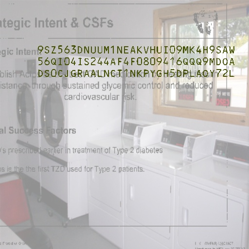
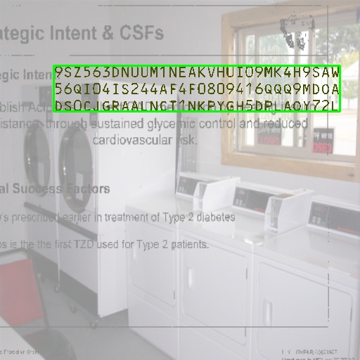
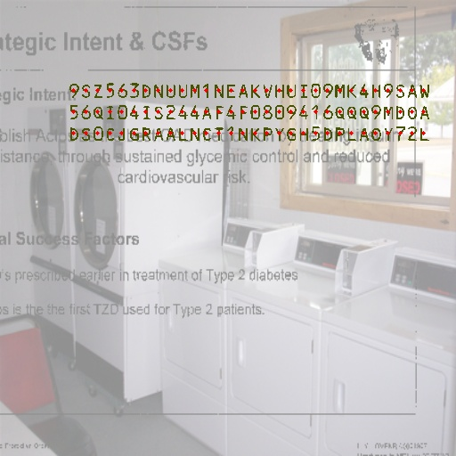
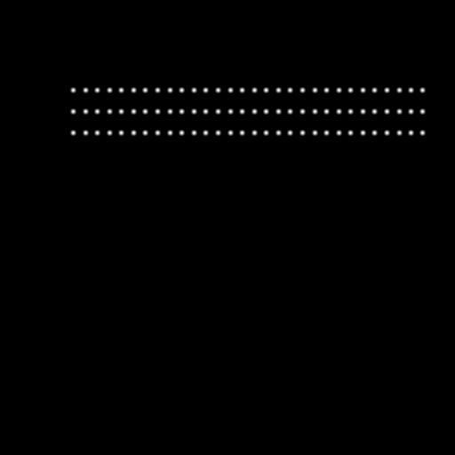
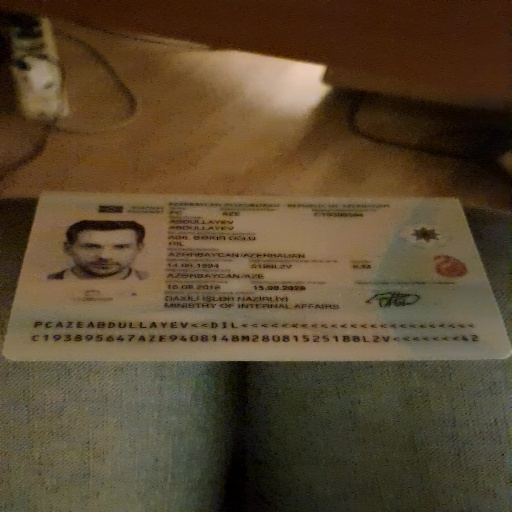

# 資料集

由於存在 MRZ 的圖片都是證件資料，我們根本找不到這麼多訓練資料。

所以打從一開始我們就沒打算用真實資料，而是全程使用「合成資料集」，我們自己寫了一個合成資料集生成器，可以生成各種不同的 MRZ 格式，並且可以控制文字的內容、字體、大小、顏色等等。

## 訓練資料集

我們雖然不開放訓練模組，但我們開放了自製的合成資料集，發佈在 GitHub 上：

- [**MRZScanner/dataset/train_dataset.py**](https://github.com/DocsaidLab/MRZScanner/blob/main/dataset/train_dataset.py)

在開始使用之前，有幾個件事是必須由讀者自行完成的：

1. 下載 `MIT Indoor Scenes` 資料集：[**MIT Indoor Scenes**](https://www.kaggle.com/datasets/itsahmad/indoor-scenes-cvpr-2019)

   我們使用這個資料集作為背景圖片，下載後找個位置放，然後啟動資料生成器的時候，把路徑指向這個資料夾。

---

2. 下載 `DocVQA` 資料集：[**DocVQA**](https://www.docvqa.org/)

   由於帶有 MRZ 的文件上通常有很多其他的文字，因此適當的模擬這種無關文字的樣態，對模型訓練是有幫助的。

   同樣的，下載之後找個位置放，然後啟動資料生成器的時候，把路徑指向這個資料夾。

   **注意：** 記得把這兩個資料夾放在一起，因為我們只有開放一個指定路徑的參數。

---

3. 安裝模組：[**WordCanvas**](https://github.com/DocsaidLab/WordCanvas)

   合成資料集依賴我們另外一個模組 `WordCanvas`，請先完成相關套件的安裝。

   - [**WordCanvas Docs**](https://docsaid.org/docs/wordcanvas/intro)

---

完成上述步驟之後，就可以開始生成資料集了。

使用方式如下：

```python
import cv2
import docsaidkit as D
from train_dataset import MRZDataset

ds = MRZDataset(
    root='/data/Dataset', # 要改成你的資料集路徑
    image_size=(512, 512),
    aug_ratio=1.0,
    return_tensor=True, # 轉成 PyTorch Tensor
    length_of_dataset=1000000, # 可以自行指定資料集大小
)
```

訓練資料集回傳值有點多，我們一起來看看：

```python
img, gt, poly, fixed_points, mrz_points_hmap, mrz_region_hmap = ds[0]
```

雖然我們指定 idx=0，但實際上 `MRZDataset` 會隨機生成資料，所以每次執行的結果都不一樣。

---

### 1. img

首先看到的是 `img`，我們直接顯示出來：

<div align="center">

</div>

### 2. gt

原始輸出的 `gt` 是一個字串，我們可以用 `split` 函數將其分割。

在預設的情況下，MRZ 會被 `&` 分割：

```python
print('GT original:', gt)
# >>> GT original: 9SZ563DNUUM1NEAKVHUI09MK4H9SAW&56QI04IS244AF4F0809416QQQ9MDOA&DS0CJGRAALNCT1NKPYGH5DPLAOY72L

print('GT:', gt.split('&'))
# >>> GT: ['9SZ563DNUUM1NEAKVHUI09MK4H9SAW',
#          '56QI04IS244AF4F0809416QQQ9MDOA',
#          'DS0CJGRAALNCT1NKPYGH5DPLAOY72L']
```

如果你要做文字辨識模型，這個字串就是你的標籤。

### 3. poly

`poly` 是 MRZ 區域的四個點，我們可以畫出來看看：

```python
import docsaidkit as D

poly_img = D.draw_polygon(img.copy(), poly, color=(0, 255, 0))
D.imwrite(poly_img, 'poly.jpg')
```

<div align="center">

</div>

如果你要做區域定位模型，可以用這個四個點作為你的標籤。

### 4. fixed_points

資料集生成器會產出 TD1, TD2, TD3 三種格式的 MRZ，每個文字長度不一樣，因此我們需要一個 `fixed_points` 來確保每個輸出的資料長度一致，否則 PyTorch 會直接報錯。

這裡的點指的是每個文字的中心點，我們以最長的 TD1 為標準，輸出字串長度為 90。

我們可以畫出來看看。

```python
import docsaidkit as D

point_img = img.copy()
for p in fixed_points:
    if p[0] == 0 and p[1] == 0:
        break
    cv2.circle(point_img, (int(p[0]), int(p[1])), 2, (0, 0, 255), -1)

D.imwrite(point_img, 'points.jpg')
```

<div align="center">

</div>

如果你要做文字點的精確定位，可以用這些點作為你的標籤。

### 5. mrz_points_hmap

`mrz_points_hmap` 是 MRZ 內「每個文字中心點」區域的 heatmap：

<div align="center">

</div>

如果你想使用關鍵點檢測的方法的話，用這張圖來監督訓練。

### 6. mrz_region_hmap

`mrz_region_hmap` 是 MRZ 文字區域的二值圖，這個比較直觀，直接畫出來看：

<div align="center">

</div>

如果你想做分割模型，就用這張圖來監督訓練。

### 小結

以上就是這個資料集所有的資訊，你可以把背景基礎資料集換成你自己的資料，例如 ImageNet 之類的。此外，文字雜訊的部分，也可以用其他帶有文字的資料集來替換原本的 DocVQA。

---

使用合成資料集訓練出來的模型，會有泛化性不足的問題，因為真實的場景和合成的場景還是有很大的差異。

就我們自己的實驗來看，使用合成資料訓練的模型，在真實世界世界的驗證集上的表現大概可以達到約 97% 的 ANLS 以及 30% 的 ACC。

這個數據的意思是，模型可以找到 97% 的 MRZ 區域上的文字，但由於每個 MRZ 區域上至少有 72 個以上的文字，全部文字都正確，才會被視為「正確」。

所以要「全對」的難度是非常高的。

**Note**：我們自己準備的驗證資料每張圖像都經過 `DocAligner` 模組校正過，並確保每個 MRZ 區域的傾斜角度都在 5 度以內。在這樣「精心打理」過的資料上，才只能達到 30% 的準確率，可見只用合成資料集是絕對不夠的。

## 微調資料集

我們找來 MIDV-2020 資料集，他們也是用合成資料集的方式生成 MRZ 圖像，雖然文字內容的變化比較單調，但他們做的圖像很精美，我們可以用這個資料集來微調我們的模型。

以下是我們實作的程式碼，只挑出資料集內帶有 MRZ 的圖像：

- [**MRZScanner/dataset/finetune_dataset.py**](https://github.com/DocsaidLab/MRZScanner/blob/main/dataset/finetune_dataset.py)

在開始使用之前，有幾個件事是必須由讀者自行完成的：

1. 下載 `MIDV-2020` 資料集：[**MIDV-2020**](http://l3i-share.univ-lr.fr/MIDV2020/midv2020.html)

   一定要下載，不然你就沒有資料可以用了。下載後找個位置放，然後啟動資料生成器的時候，把路徑指向這個資料夾。

---

完成上述步驟之後，就可以開始生成資料集了。

使用方式如下：

```python
import docsaidkit as D
from finetune_dataset import MRZFinetuneDataset

ds = MRZFinetuneDataset(
    root='/data/Dataset', # 要改成你的資料集路徑
    image_size=(512, 512),
    aug_ratio=1.0,
    return_tensor=True, # 轉成 PyTorch Tensor
)
```

訓練資料集回傳值有點多，我們一起來看看：

```python
img, gt = ds[1]
```

沒了！這裡只有圖像和標籤，沒有其他的資訊。

這也是最後我們訓練模型只使用文字監督，而沒有使用其他輔助分支的原因：

**因為可以用來微調的資料，大概率只有文字，沒有其他的資訊。**

---

### 1. img

雖然沒什麼好說的，但我們還是把圖像顯示出來：

<div align="center">

</div>

### 2. gt

原始輸出的 `gt` 是一個字串，我們可以直接顯示出來：

```python
print('GT:', gt)
# >>> GT: PCAZEABDULLAYEV<<DIL<<<<<<<<<<<<<<<<<<<<<<<<C193895647AZE9408148M28081525188L2V<<<<<<<42

print('GT:', gt.split('&'))
# >>> GT: ['PCAZEABDULLAYEV<<DIL<<<<<<<<<<<<<<<<<<<<<<<<',
#          'C193895647AZE9408148M28081525188L2V<<<<<<<42']
```

## 訓練策略

講完了數據集，我們再來談談訓練策略。

我們使用合成數據集進行預訓練，設定參數為：

```python
ds = MRZDataset(
    root='/data/Dataset',
    image_size=(512, 512),
    aug_ratio=1.0,
    return_tensor=True,
    length_of_dataset=640000,
)
```

我們訓練 100 個 epoch，使用 AdamW 優化器，Weight Decay 設定為 1e-5，學習率設定為 1e-4，搭配線性衰減規劃。此外，學習率會先經過 10 個 epoch 的線性上升，然後再線性下降。

做完預訓練之後，我們使用微調數據集進行微調，設定參數為：

```python
ds = MRZFinetuneDataset(
    root='/data/Dataset',
    image_size=(512, 512),
    aug_ratio=1.0,
    return_tensor=True,
)
```

微調使用 AdamW 優化器，Weight Decay 設定為 1e-1，學習率設定為 1e-6。

觀察驗證資料表現不在上升時，停止訓練。

## 結論

這就是我們的資料集，我們希望這個資料集可以幫助到你。

如果你有更多可以用來微調的資料，歡迎分享給我們，我們會把這些資料整合到我們的資料集中，讓模型具有更好的泛化性。
